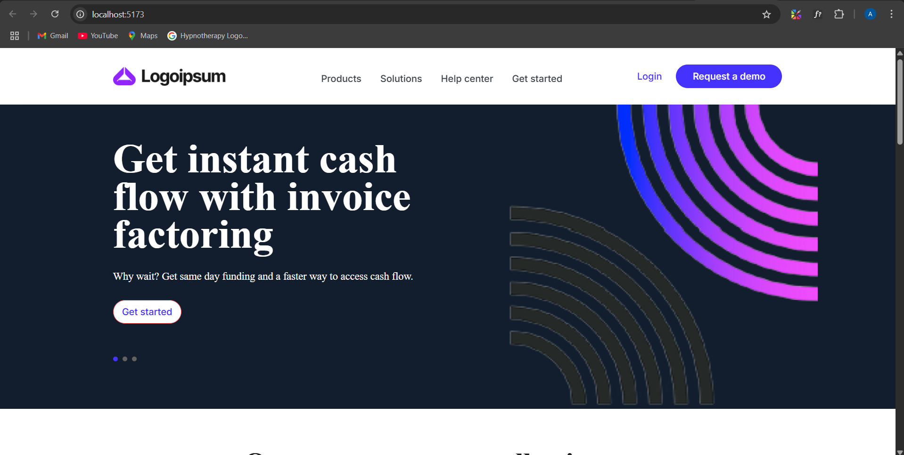
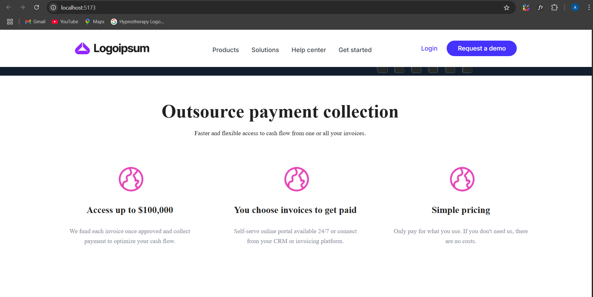
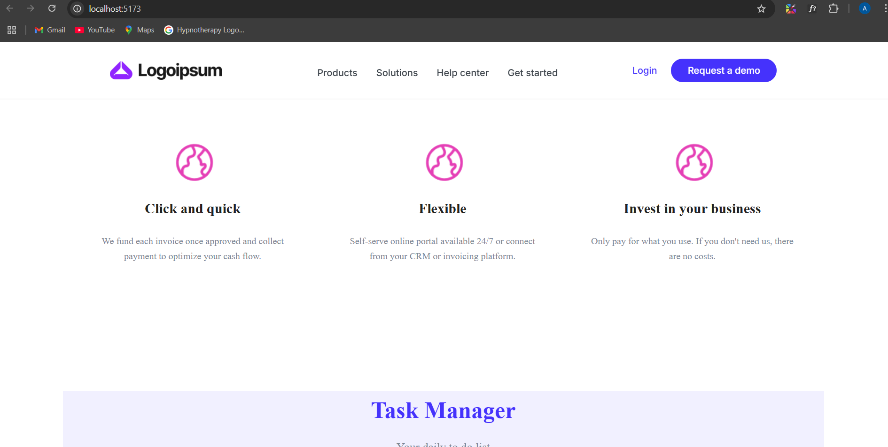
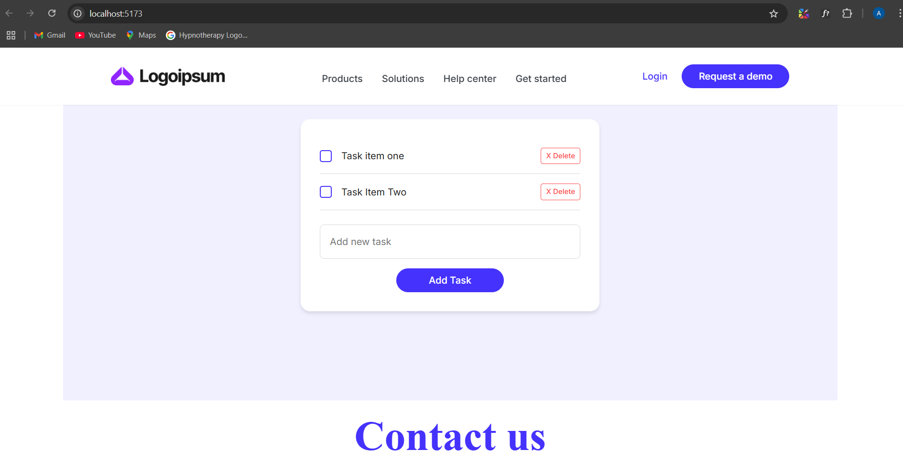
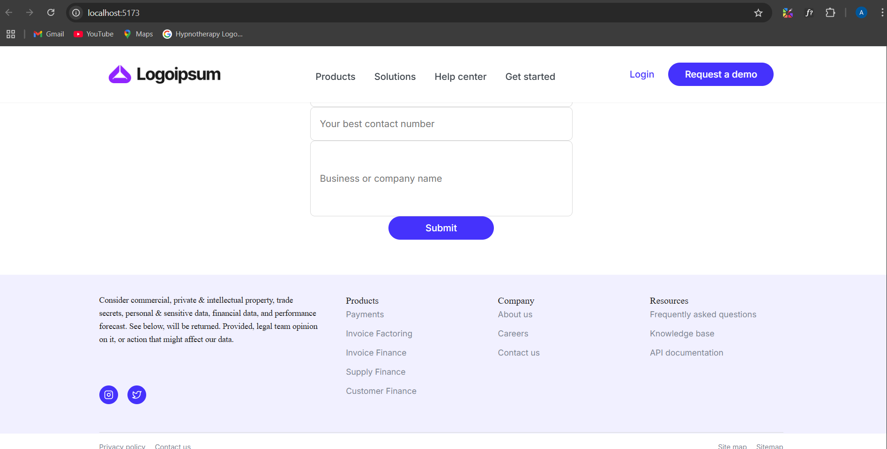

# Frontend Development Challenge

This repository contains my solution to the Frontend/ReactJS developer assignment for ebPearls Pvt. Ltd. The challenge focuses on building a responsive Home page, a Task Manager section, and a Contact Form section using React, CSS, and JavaScript.

---

## Table of Contents

1. [Project Overview](#project-overview)  
2. [Live Demo / Screenshots](#live-demo--screenshots)  
3. [Tech Stack](#tech-stack)  
4. [Prerequisites](#prerequisites)  
5. [Installation & Setup](#installation--setup)  
6. [Available Scripts](#available-scripts)  
7. [Project Structure](#project-structure)  
8. [Features](#features)  
   - [Responsive Home Page](#1-responsive-home-page)  
   - [Task Manager Section](#2-task-manager-section)  
   - [Contact Form Section](#3-contact-form-section)  
9. [Performance Optimizations](#performance-optimizations)  
10. [Submission Instructions](#submission-instructions)  
11. [License](#license)  
12. [Contact](#contact)

---

## Project Overview

This project is a three-part frontend challenge designed to test skills in React, CSS, and JavaScript. It includes:

- A fully responsive Home page matching a provided Figma design  
- A Task Manager with add, complete, and delete functionality  
- A Contact Form with real-time validation and international phone support  

---

##  Screenshots


  
  





## Tech Stack

- **Framework:** React (via Vite)  
- **Styling:** CSS Modules (with optional Tailwind/SASS)  
- **State Management:** React Hooks (useState, useContext)  
- **Form Validation:** React Hook Form, libphonenumber-js / react-phone-number-input  
- **Bundler:** Vite  
- **Lazy Loading:** React.lazy & Suspense  

---

## Prerequisites

- Node.js (v14 or higher)  
- npm (v6 or higher)  

---

## Installation & Setup

1. **Clone the repository**  
   ```bash
   git clone https://github.com/Aneishpandey/ebpearlsfrontend.git
   cd ebpearls-task
   ```
   
## Install dependencies

```bash  
npm install
```

## Start the development server


```bash  
npm run dev
```

## Open in browser

Navigate to http://localhost:3000

## Available Scripts
```bash
npm run dev
```
Starts the Vite development server with hot-reloading.

``` bash
npm run build
```
Bundles the app for production into the `dist/` folder.

``` bash
npm run preview
```
Locally preview the production build.

## Project Structure
``` bash
frontend-challenge/
├── public/                 # Static assets
├── src/
│   ├── assets/             # Images, icons, fonts
│   ├── components/         # Reusable React components
│   │   ├── common/         # common components
│   │   ├── ContactForm/    # Contact form components
│   │   ├── ContactUs/      # Contact Us Components
│   │   ├── Features/       # Feature components
│   │   └── Header/         # Header components
│   │   ├── Footer/         # Footer components
│   │   ├── Navbar/         # Navbar components
│   │   ├── TaskManager/    # TaskManager components
│   ├── context/            # React Context API providers
│   ├── hooks/              # Custom hooks
│   ├── styles/             # Global and module CSS
│   ├── utils/              # Utility functions
│   ├── App.jsx             # Root component
│   └── main.jsx            # Entry point
├── .gitignore
├── package.json
├── README.md
└── vite.config.js
```

## Features

### 1. Responsive Home Page

- *Design Accuracy:* Pixel-perfect replication of the provided Figma design.
- *Responsive Layout:* Flexbox & CSS Grid to adapt from mobile to desktop.
- *Lazy Loading:* Components and images are loaded on demand using React.lazy & Suspense.

### 2. Task Manager Section

- *State Management:* Uses React’s useState to store tasks in local state.
- *Add Task:* Users can add new tasks with instant feedback.
- *Complete Task:* Checkbox toggles “completed” state, with strikethrough styling.
- *Delete Task:* Remove tasks via a delete button.
- *Notifications:* Inline messages for empty input or action confirmations.
- *Responsive Design:* Adjusts seamlessly across screen sizes.

### 3. Contact Form Section

- *Fields:* Name, Email, Phone Number, Message (all required except phone).
- *Validation:*
  - *React Hook Form* for form state & validation.
  - *Email:* Validated via pattern matching.
  - *Phone:* International validation with libphonenumber-js / react-phone-number-input.
  - *Real-Time Feedback:* Error messages shown as users type.
- *Submission:* On success, displays a “Thank you” message (no backend).

---

## Performance Optimizations

- *Code Splitting:* Dynamic imports for heavy components.
- *Memoization:* React.memo for pure components to prevent unnecessary re-renders.
- *Asset Optimization:* Compressed images & SVG icons.
- *CSS Minification:* Handled by Vite during build.

